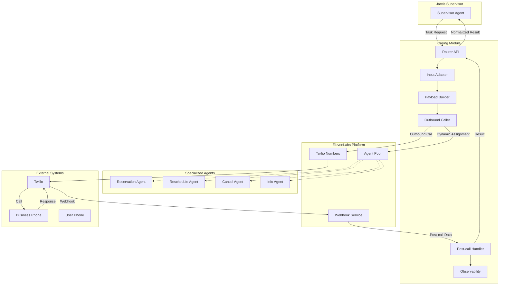

# Jarvis Calling Module

A sophisticated channel-scoped capability for the Jarvis multi-agent system that enables intelligent outbound phone calls to businesses on behalf of users. The module features specialized AI agents that can handle complex conversations for reservations, scheduling, cancellations, and information requests.

## 🎯 Core Features

- **🤖 Multi-Agent Architecture**: Four specialized AI agents for different task types
- **📞 Real Phone Integration**: Live calls using ElevenLabs managed agents with Twilio
- **🔄 Dynamic Agent Assignment**: Single phone number dynamically assigned to appropriate agent
- **🛡️ Webhook Security**: HMAC signature verification for secure webhook processing
- **📊 Intelligent Analysis**: Automatic extraction of booking references, dates, and outcomes
- **🌍 International Support**: German phone number normalization and multi-locale support
- **📝 Comprehensive Logging**: Full conversation transcripts and detailed observability
- **🧪 Real-World Testing**: Extensive test suite with actual phone call scenarios

## 🤖 Specialized Agents

### 1. **Reservation Agent** (`agent_4301k60cs35yfw6arterxb0axtps`)
**Purpose**: Making new reservations and bookings
**Capabilities**:
- Restaurant table reservations
- Hotel room bookings  
- Hairdresser appointments
- Any service requiring advance booking

**Dynamic Variables**:
- `context_summary`: Brief description of the booking purpose
- `availability_text`: Human-readable time windows
- `party_size`: Number of people
- `notes`: Special requirements or preferences
- `budget_range`: Price range (when relevant)
- `expected_duration`: How long the service takes

### 2. **Reschedule Agent** (`agent_reschedule_id`)
**Purpose**: Modifying existing reservations
**Capabilities**:
- Moving appointments to new dates/times
- Changing party sizes
- Updating special requirements
- Handling rescheduling policies

**Dynamic Variables**:
- `context_summary`: Type of existing booking
- `current_date`: Original reservation date
- `new_availability_text`: Preferred new time slots
- `booking_reference`: Existing reservation ID
- `notes`: Reason for rescheduling

### 3. **Cancel Agent** (`agent_cancel_id`)
**Purpose**: Canceling existing reservations
**Capabilities**:
- Processing cancellation requests
- Handling cancellation policies and fees
- Providing confirmation numbers
- Managing refund policies

**Dynamic Variables**:
- `context_summary`: Type of booking to cancel
- `current_date`: Original reservation date
- `booking_reference`: Reservation ID
- `name_on_reservation`: Name used for booking
- `notes`: Reason for cancellation

### 4. **Info Agent** (`agent_info_id`)
**Purpose**: Gathering information about businesses
**Capabilities**:
- Checking availability
- Getting business hours
- Inquiring about policies
- Requesting pricing information

**Dynamic Variables**:
- `context_summary`: Specific information needed
- `question_type`: Type of inquiry (availability, hours, price, etc.)
- `context`: Additional details for the question
- `notes`: Specific requirements or preferences

## 🏗️ Architecture



### How It Works

1. **Task Reception**: Supervisor sends task request to `/start_call` endpoint
2. **Input Processing**: Input adapter validates and normalizes the request
3. **Agent Selection**: Payload builder determines which specialized agent to use
4. **Dynamic Assignment**: Outbound caller assigns phone number to selected agent
5. **Call Initiation**: ElevenLabs initiates call through Twilio to business
6. **Conversation**: Specialized agent conducts conversation with business
7. **Webhook Processing**: Post-call handler receives and processes conversation data
8. **Result Normalization**: System extracts artifacts and returns standardized result

## 📁 Project Structure

```
📁 calling_module/           # Core calling module package
│   ├── __init__.py         # Package initialization
│   ├── config.py           # Configuration management
│   ├── contracts.py        # Data structures and interfaces
│   ├── input_adapter.py    # Input validation and normalization
│   ├── payload_builder.py  # Agent metadata preparation
│   ├── outbound_caller.py  # ElevenLabs SDK integration
│   ├── postcall_handler.py # Outcome processing and normalization
│   ├── router.py           # Public API interface
│   ├── observability.py    # Logging and metrics
│   └── tool_webhook.py     # Mid-call tool handlers
📁 tests/                    # All test files (unit + real phone tests)
│   ├── test_calling_module.py              # Unit tests with mocks
│   ├── test_with_real_phone.py             # Reservation agent tests
│   ├── test_with_real_phone_reschedule.py  # Reschedule agent tests
│   ├── test_with_real_phone_cancel.py      # Cancel agent tests
│   ├── test_with_real_phone_info.py        # Info agent tests
│   └── test_postcall_handler.py            # Webhook simulation tests
📁 docs/                     # Documentation and guides
│   ├── PROJECT_STRUCTURE.md                # Detailed project organization
│   ├── TEST_CALL_GUIDE.md                  # Testing instructions
│   ├── TEST_SCENARIOS_GUIDE.md             # Reservation scenarios
│   ├── CANCEL_AGENT_TEST_GUIDE.md          # Cancel agent guide
│   ├── INFO_AGENT_TEST_GUIDE.md            # Info agent guide
│   ├── DYNAMIC_PHONE_ASSIGNMENT.md         # Phone assignment docs
│   └── POSTCALL_HANDLER_EXPLANATION.md     # Webhook processing guide
📄 main.py                   # FastAPI application entry point
📄 requirements.txt          # Python dependencies
📄 env.example               # Environment variables template
📄 README.md                 # This file
📄 PHONE_NUMBERS.md          # Phone number configuration
```

See [`docs/PROJECT_STRUCTURE.md`](docs/PROJECT_STRUCTURE.md) for detailed organization.

## Quick Start

### 1. Install Dependencies

```bash
pip install -r requirements.txt
```

### 2. Configure Environment

Copy the example environment file and fill in your credentials:

```bash
cp env.example .env
```

Required environment variables:
- `ELEVENLABS_API_KEY`: Your ElevenLabs API key
- `ELEVENLABS_AGENT_ID`: Your reservation agent ID (default agent)
- `ELEVENLABS_AGENT_PHONE_NUMBER_ID`: Your ElevenLabs agent phone number ID
- `ELEVENLABS_RESCHEDULE_AGENT_ID`: Your reschedule agent ID (optional)
- `ELEVENLABS_CANCEL_AGENT_ID`: Your cancel agent ID (optional)
- `ELEVENLABS_INFO_AGENT_ID`: Your info agent ID (optional)
- `ELEVENLABS_WEBHOOK_SECRET`: Webhook signature verification secret
- `TWILIO_FROM_NUMBER`: Source phone number (defaults to +15205953159)

### 3. Run the Service

```bash
python main.py
```

The service will start on `http://localhost:8000`

### 4. Configure Webhooks (Optional but Recommended)

For production use, configure ElevenLabs webhooks:

1. **Set webhook URL**: `https://your-domain.com/postcall`
2. **Configure webhook secret**: Add to your `.env` file
3. **Enable webhooks** in your ElevenLabs agent settings

### 5. API Endpoints

- `POST /start_call` - Initiate an outbound call
- `POST /postcall` - Process post-call webhooks from ElevenLabs
- `POST /tools/{tool_name}` - Mid-call tool webhooks
- `GET /health` - Health check
- `GET /metrics` - Service metrics
- `GET /debug/config` - Debug configuration (development only)

## 💡 Usage Examples

### Making a Reservation

```python
import requests

# Restaurant reservation request
task_data = {
    "business": {
        "phone": "+491706255818",  # German restaurant
        "name": "Bella Vista Restaurant",
        "timezone": "Europe/Berlin"
    },
    "user": {
        "name": "Maria Schmidt",
        "callback_phone": "+15205953159"
    },
    "intent": "reserve",
    "reservation": {
        "date": "2024-01-20",
        "time_window": {
            "start_time": "19:00",
            "end_time": "21:00"
        },
        "party_size": 2,
        "notes": "Anniversary dinner for our 5th wedding anniversary",
        "budget_range": "€60–100 per person"
    },
    "locale": "en-US",
    "policy": {
        "autonomy_level": "medium",
        "max_call_duration_minutes": 4
    }
}

response = requests.post("http://localhost:8000/start_call", json=task_data)
call_id = response.json()["call_id"]
```

### Rescheduling a Reservation

```python
# Reschedule existing booking
task_data = {
    "business": {
        "phone": "+1234567890",
        "name": "Grand Hotel",
        "timezone": "America/New_York"
    },
    "user": {
        "name": "John Doe",
        "callback_phone": "+0987654321"
    },
    "intent": "reschedule",
    "reschedule": {
        "current_date": "2024-01-15",
        "current_time_window": {
            "start_time": "19:00",
            "end_time": "21:00"
        },
        "new_date": "2024-01-16",
        "new_time_window": {
            "start_time": "20:00",
            "end_time": "22:00"
        },
        "booking_reference": "REF123456",
        "party_size": 2,
        "notes": "Need to move due to work schedule change"
    },
    "locale": "en-US",
    "policy": {
        "autonomy_level": "medium",
        "max_call_duration_minutes": 4
    }
}
```

### Canceling a Reservation

```python
# Cancel existing booking
task_data = {
    "business": {
        "phone": "+1234567890",
        "name": "Hair Salon",
        "timezone": "America/New_York"
    },
    "user": {
        "name": "Jane Smith",
        "callback_phone": "+0987654321"
    },
    "intent": "cancel",
    "cancel": {
        "current_date": "2024-01-15",
        "current_time_window": {
            "start_time": "14:00",
            "end_time": "15:00"
        },
        "booking_reference": "REF789",
        "notes": "Emergency came up"
    },
    "locale": "en-US",
    "policy": {
        "autonomy_level": "medium",
        "max_call_duration_minutes": 3
    }
}
```

### Requesting Information

```python
# Get business information
task_data = {
    "business": {
        "phone": "+1234567890",
        "name": "Spa Resort",
        "timezone": "America/New_York"
    },
    "user": {
        "name": "Alex Johnson",
        "callback_phone": "+0987654321"
    },
    "intent": "info",
    "info": {
        "question_type": "availability",
        "context": "Check availability for 2 people next weekend",
        "notes": "Looking for couples massage package"
    },
    "locale": "en-US",
    "policy": {
        "autonomy_level": "medium",
        "max_call_duration_minutes": 3
    }
}
```

### Processing Post-Call Results

The service automatically processes webhooks from ElevenLabs and returns normalized results with full conversation analysis:

```python
# Example webhook response from ElevenLabs (simplified)
webhook_payload = {
    "type": "post_call_transcription",
    "data": {
        "conversation_id": "conv_123456789",
        "status": "done",
        "transcript": [
            {
                "role": "agent",
                "text": "Hello, this is Alfred calling on behalf of Maria Schmidt...",
                "timestamp": "2024-01-20T19:00:00Z"
            },
            {
                "role": "user", 
                "text": "Hello, this is Jonas from Bella Vista Restaurant...",
                "timestamp": "2024-01-20T19:00:05Z"
            }
            // ... more conversation turns
        ],
        "analysis": {
            "transcript_summary": "Successfully booked table for 2 people at 19:30",
            "call_successful": true
        }
    }
}

# Result will be automatically normalized to:
{
    "status": "completed",
    "message": "Successfully completed task. Booking reference: REF123",
    "next_action": "add_to_calendar",
    "core_artifact": {
        "booking_reference": "REF123",
        "confirmed_date": "2024-01-20T00:00:00",
        "confirmed_time": "19:30:00",
        "party_size": 2,
        "total_cost": "$120.00",
        "confirmation_code": "ABC123"
    },
    "observations": {
        "offered_alternatives": ["18:00", "20:00"],
        "business_hours": "17:00-23:00",
        "cancellation_policy": "24 hours notice required",
        "payment_methods": ["credit card", "cash"]
    },
    "evidence": {
        "provider_call_id": "conv_123456789",
        "call_duration_seconds": 180
    }
}
```

## Status Vocabulary

The module returns standardized status values:

- `completed` - Task succeeded
- `no_availability` - No slots available
- `no_answer` - Business didn't answer
- `voicemail` - Went to voicemail
- `ivr_blocked` - Blocked by IVR system
- `needs_user_input` - Missing required information
- `timeout` - Call duration exceeded
- `error` - Technical failure

## Next Actions

Based on the call outcome, the module suggests next actions:

- `add_to_calendar` - Add confirmed appointment to calendar
- `retry_later` - Retry the call at a different time
- `request_user_input` - Ask user for additional information
- `switch_channel` - Try a different communication channel
- `none` - No specific action needed

## 🧪 Testing

### Unit Tests
Run the comprehensive unit test suite with mocks:

```bash
pytest tests/test_calling_module.py -v
```

### Real Phone Tests
Test with actual phone calls using different agents and scenarios:

```bash
# Reservation agent tests (3 scenarios each)
python tests/test_with_real_phone.py restaurant
python tests/test_with_real_phone.py hotel
python tests/test_with_real_phone.py hairdresser

# Reschedule agent tests (3 scenarios each)
python tests/test_with_real_phone_reschedule.py restaurant
python tests/test_with_real_phone_reschedule.py hotel
python tests/test_with_real_phone_reschedule.py hairdresser

# Cancel agent tests (3 scenarios each)
python tests/test_with_real_phone_cancel.py restaurant
python tests/test_with_real_phone_cancel.py hotel
python tests/test_with_real_phone_cancel.py hairdresser

# Info agent tests (3 scenarios each)
python tests/test_with_real_phone_info.py restaurant
python tests/test_with_real_phone_info.py hotel
python tests/test_with_real_phone_info.py hairdresser
```

### Webhook Processing Tests
Simulate ElevenLabs webhook scenarios:

```bash
python tests/test_postcall_handler.py
```

### Test Configuration

**Phone Numbers Used:**
- **Target Number**: `+491706255818` (Jonas's phone for testing)
- **Source Number**: `+15205953159` (Twilio number)

**Test Scenarios Include:**
- ✅ **Restaurant reservations** (anniversary dinner, business lunch, family dinner)
- ✅ **Hotel bookings** (weekend getaway, business trip, family vacation)
- ✅ **Hairdresser appointments** (haircut, coloring, special styling)
- ✅ **Reschedule scenarios** (work conflicts, weather, emergencies)
- ✅ **Cancellation scenarios** (illness, travel changes, double bookings)
- ✅ **Information requests** (availability, hours, policies, pricing)

See [`docs/`](docs/) for detailed testing guides and role-playing instructions for each agent type.

## Architecture

The module is designed with clean separation of concerns:

- `contracts.py` - Data structures and interfaces
- `input_adapter.py` - Input validation and normalization
- `payload_builder.py` - Agent metadata preparation
- `outbound_caller.py` - ElevenLabs SDK integration
- `postcall_handler.py` - Outcome processing and normalization
- `router.py` - Public API interface
- `observability.py` - Logging and metrics
- `tool_webhook.py` - Mid-call tool handlers

## Security

- Phone numbers are redacted in logs
- Webhook signature verification (in production)
- PII protection in metadata
- Idempotency keys prevent duplicate calls
- Call duration limits enforced

## Development

### Adding New Tools

To add a new mid-call tool:

1. Add the tool function to `tool_webhook.py`
2. Register it in the `tools` dictionary
3. Add tests for the new tool
4. Update the `/tools` endpoint documentation

### Extending Status Vocabulary

To add new status types:

1. Add the status to `CallStatus` enum in `contracts.py`
2. Add pattern matching in `postcall_handler.py`
3. Update tests with new scenarios
4. Document the new status

## 🚀 Key Technical Achievements

### Production-Ready Features
- **✅ Real ElevenLabs Integration**: Direct SDK integration with dynamic agent assignment
- **✅ Webhook Security**: HMAC signature verification with timestamp validation
- **✅ International Support**: German phone number normalization and multi-locale handling
- **✅ Type Safety**: Comprehensive error handling and input validation
- **✅ Observability**: Full conversation transcripts and detailed logging
- **✅ Modular Architecture**: Clean separation of concerns for maintainability

### Advanced Capabilities
- **🤖 Multi-Agent System**: Four specialized agents for different conversation types
- **🔄 Dynamic Phone Assignment**: Single phone number intelligently assigned to appropriate agent
- **📊 Intelligent Analysis**: Automatic extraction of booking references, dates, and business policies
- **🌍 Real-World Testing**: Extensive test suite with actual phone call scenarios
- **🛡️ Security**: Production-grade webhook verification and PII protection

### Performance & Reliability
- **⚡ Fast Response**: Optimized payload building and call initiation
- **🔄 Idempotency**: Prevents duplicate calls with unique tracking keys
- **📈 Scalable**: Designed for high-volume production use
- **🔧 Maintainable**: Comprehensive documentation and modular code structure

## 📚 Documentation

- [`docs/PROJECT_STRUCTURE.md`](docs/PROJECT_STRUCTURE.md) - Detailed project organization
- [`docs/TEST_CALL_GUIDE.md`](docs/TEST_CALL_GUIDE.md) - Testing instructions
- [`docs/TEST_SCENARIOS_GUIDE.md`](docs/TEST_SCENARIOS_GUIDE.md) - Reservation scenarios
- [`docs/CANCEL_AGENT_TEST_GUIDE.md`](docs/CANCEL_AGENT_TEST_GUIDE.md) - Cancel agent guide
- [`docs/INFO_AGENT_TEST_GUIDE.md`](docs/INFO_AGENT_TEST_GUIDE.md) - Info agent guide
- [`docs/DYNAMIC_PHONE_ASSIGNMENT.md`](docs/DYNAMIC_PHONE_ASSIGNMENT.md) - Phone assignment docs
- [`docs/POSTCALL_HANDLER_EXPLANATION.md`](docs/POSTCALL_HANDLER_EXPLANATION.md) - Webhook processing guide

## 🤝 Contributing

This calling module is part of the Jarvis multi-agent system. For development:

1. **Follow the modular architecture** - each component has a single responsibility
2. **Add comprehensive tests** - both unit tests and real phone tests
3. **Update documentation** - keep guides and examples current
4. **Use proper logging** - structured logging with correlation IDs
5. **Handle errors gracefully** - comprehensive error handling and user feedback

## License

This project is part of the Jarvis multi-agent system.
